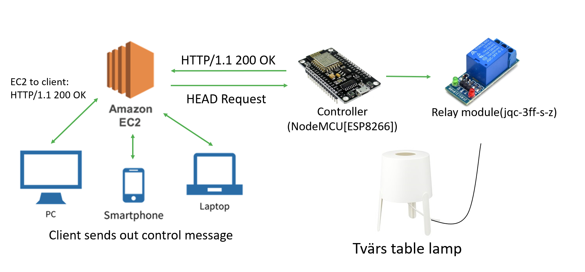
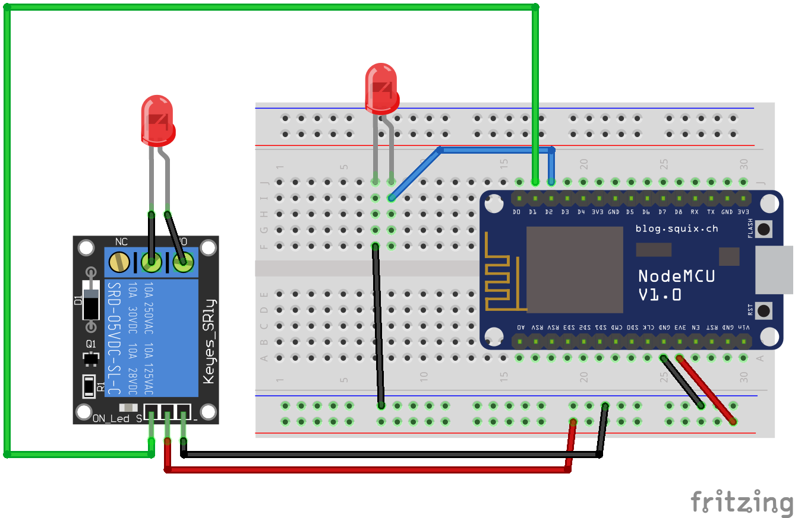

# Remote Switch
This project allows users (clients) to control their switches remotely through cloud (AWS EC2).

### System architecture

### Wiring diagram
 \
We use left LED to represent the lamp that we used in the project and take right LED as Wi-Fi signal indicator. \
*(Note: The parts in the wiring diagram are not exactly the same as the parts that we used.)*

# Test Environment
+ AWS EC2 - Ubuntu Server 18.04 LTS (HVM), SSD Volume Type
+ NodeMCU (ESP8266)
+ Relay module (jqc-3ff-s-z)
+ Node.js 13.5.0 (with npm 6.13.4 installed)

# [Package Requirements](./requirements.bat)
+ express==4.17.1 (for Node.js)
+ ESP8266WiFi (for NodeMCU)

# License
This project is under the [MIT License](./LICENSE).
